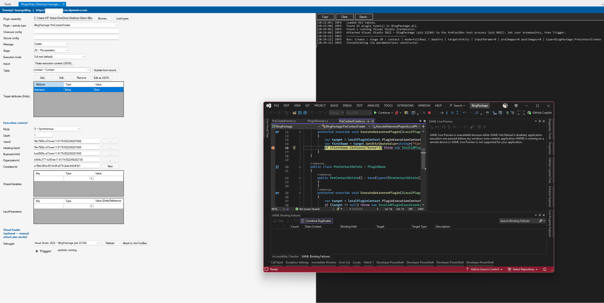

# PluginXray for XrmToolBox

**Debug a Dataverse plugin (or custom workflow activity) with a real Visual Studio debugger
attached — without registering it in the environment.**

PluginXray executes your freshly-built plugin assembly under a *synthesized* execution context.
You hydrate that context from a live record, point the tool at your plugin `.dll`, set breakpoints
in Visual Studio, and click **Trigger**. Your breakpoints bind and hit — no plugin registration, no
real platform operation required. Rebuild in VS and Trigger again with no XrmToolBox restart.

> **Hydrate a context from a live record, hit a breakpoint, iterate — no registration, no real
> platform trigger required.**

---

## How it works (the Demo)



The screenshot above is a complete debug session. On the **left** is the PluginXray tool inside
XrmToolBox; **top-right** is its run log; **bottom-right** is Visual Studio 2022 stopped on a
breakpoint inside the plugin — all in one Trigger, with the plugin never registered.

Reading the session left-to-right:

1. **Connection guard (top bar).** The connected environment name and URL — `Temmy3-InsurgoBlog |
   https://…crm.dynamics.com` — are shown persistently, because Full-real runs execute against it.
2. **Plugin assembly.** `Browse…` to the built `.dll` on disk (here under `…\Desktop\Demo\`), then
   **Load types** to enumerate the `IPlugin` / code-activity types inside it.
3. **Plugin / activity type.** Pick the type to run — `BlogPackage.PreContactCreate`. (Unsecure /
   Secure config boxes accept the plugin's registration config strings if it uses them.)
4. **Message + Stage.** `Create` / `20 – Pre-operation`. This pair reshapes the rest of the form:
   which Target editor appears, which image panels are enabled, and which extra fields show.
5. **Execution mode.** `Full real (default)` — every SDK call the plugin makes hits the live org.
   Switch to *Read-real / write-mock* or *Full mock* for safe, non-writing iteration.
6. **Table + hydration.** `contact – Contact` sets the primary entity. `Hydrate from record…` pulls
   a real record so you can seed the Target from live data.
7. **Target attributes.** The add-only, metadata-typed editor. Here one attribute — `firstname`
   (String) = `Error` — is set to deliberately trip the plugin's guard clause.
8. **Execution context.** Mode, Depth, and the identity fields (UserId, InitiatingUserId,
   BusinessUnitId, OrganizationId, CorrelationId) — defaulted from WhoAmI on connect, each
   overridable. SharedVariables and arbitrary InputParameters have their own key/value grids below.
9. **Visual Studio attach.** Pick a running VS instance — `Visual Studio 2022 – BlogPackage
   (pid 22184)` — and **Attach to XrmToolBox** binds its debugger to the host process. (Manual
   attach also works.)
10. **Trigger.** Click it. The **symbols: running…** indicator confirms the `.pdb` loaded so
    breakpoints will bind.

The **run log** (top-right) then narrates the run — tables loaded, plugin type found, VS attached,
and the run line `Run: Create / stage 20 / contact | mode=FullReal | depth=1 …`. Execution enters
the plugin, and **Visual Studio stops on the breakpoint** at
`if (firstName.Contains("Error")) throw new InvalidPlugin…` — exactly where you'd expect, with the
full live-connected `IOrganizationService` and context available to inspect.

**The iterate loop:** fix code in VS → rebuild → click **Trigger** again. A fresh shadow-copied
AppDomain loads the new build every run, so the original `.dll` never locks and XrmToolBox never
needs a restart.

---

## Step-by-step usage

1. **Open** PluginXray in XrmToolBox and **connect** to an environment. Confirm the environment
   name/URL in the top bar is the one you intend (a production connection shows a distinct warning).
2. **Browse** to your built plugin `.dll` and click **Load types**. Pick your plugin (or custom
   workflow activity) type. Supply Unsecure/Secure config if the plugin reads them.
3. **Choose Message + Stage** (Create / Update / Delete, stage 10 / 20 / 40). The form reshapes to
   match — impossible combinations (e.g. a PostImage on a pre-operation stage) are disabled.
4. **Pick the Table**, and optionally **Hydrate from record…** to seed the Target/images from a live
   record. For Update, hydration defaults to *no* attributes checked so the Target stays
   "changed attrs only," matching production fidelity.
5. **Edit the Target / images** with the typed editor — each attribute gets a type-appropriate input
   (string/bool/number/Money/DateTime/OptionSet/MultiSelect/Guid/lookup). Or paste a whole captured
   context with **Paste execution context (JSON)…**.
6. **Set execution-context fields** as needed (Mode, Depth, identities, SharedVariables,
   InputParameters).
7. **Pick your execution mode.** *Full real* writes to the live org (and requires a per-run
   confirmation); use *write-mock* or *full-mock* to iterate without side effects.
8. **Attach Visual Studio**: select the VS instance and click **Attach to XrmToolBox**, then set
   breakpoints in your plugin source. Watch for **symbols: running / ✓** so you know the PDB bound.
9. **Trigger.** Breakpoints hit. Inspect, fix, rebuild in VS, and **Trigger** again — no restart.

> **Fidelity note:** this is not a sandbox-faithful execution. There is no platform transaction
> (Full-real partial writes are *not* rolled back on failure), no depth/loop guard, and the plugin
> runs with the connection user's privileges. A green run does not guarantee production success.

---

## Key features

- **Three execution modes** — full-real / read-real-write-mock / full-mock — selectable per run.
- **Per-run shadow-copy child AppDomain** so the original `.dll` stays unlocked; rebuild in VS
  between runs with no restart. PDB copied alongside, with a **symbols loaded ✓/✗** indicator.
- **Message + Stage form-shape engine** — the resolved shape drives the Target editor, image panels,
  and `OutputParameters["id"]`; impossible combinations are disabled, not merely warned.
- **Metadata-driven typed attribute/image editor** — type-appropriate inputs, polymorphic-lookup
  target chooser, record pickers, multiple keyed pre/post images, and typed-envelope JSON
  import/export (plain values rejected for ambiguous columns).
- **Full execution-context import** — paste a serialized `IExecutionContext` (the platform's
  DataContract-JSON shape from PRT profiler / trace logs) to hydrate the entire form in one action.
- **Custom workflow activity (code activity) support** — same load/attach/iterate loop, with
  typed In/Out argument editors under a synthesized `IWorkflowContext`.
- **Visual Studio auto-attach** — enumerates running VS 2019/2022 instances and attaches to the
  XrmToolBox host process; manual attach always works as a fallback.
- **Copyable/exportable run log** — trace output, every SDK request (real/mock annotated),
  exceptions, and final `OutputParameters`.

---

## Repository layout

```
src/PluginDebugger.Runtime/   net48 class lib — all cross-AppDomain types (SDK refs only)
src/PluginDebugger/           net48 WinForms — the XrmToolBox plugin (UI)
samples/SamplePlugin/         net462 sample IPlugin used for validation
tests/SmokeTest/              net48 console harness that drives PluginRunner directly
```

The runtime is split out so it can be loaded into the child AppDomain without dragging WinForms
along. The cross-domain marshaling design (why SDK objects travel as XML strings, not by value) is
documented in the source headers of `ServiceBridge`, `ChildServices`, and `PluginExecutor`.